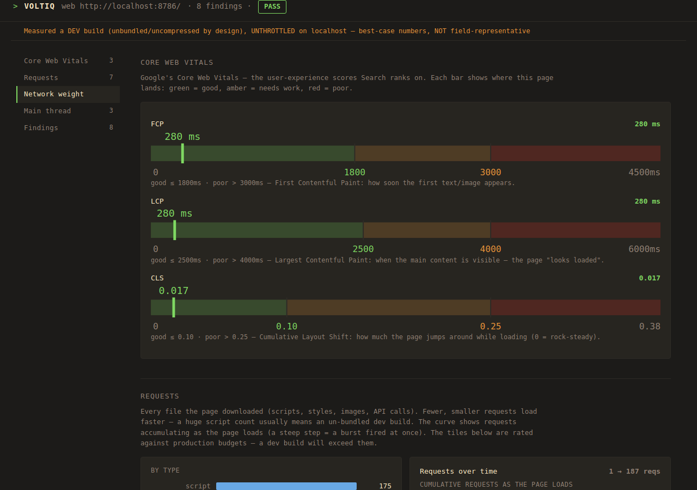

# voltiq

**AI-first performance + security scanner for any Node.js app.**




> One command. `voltiq` drives a real browser against your running app, captures the Core
> Web Vitals + network, and reports the **root-cause files** — no config. Add `--prod` for a
> real-user verdict.

**DEV** — point it at your dev server (unbundled, best-case numbers):


**PRO** — `--prod --lab --throttle`, the field-representative verdict (real-user conditions):


**More:** [the full run as video (mp4)](docs/demo-full.mp4) · [the complete report dashboard](docs/dashboard-full.png) · [CLI ↔ dashboard side-by-side](docs/cli-vs-dashboard.png)

`voltiq` is a single cross-platform Rust binary that measures the runtime health
(startup, throughput, latency, memory/leaks) **and** secret hygiene (leaked creds,
client-bundle exposure, committed `.env`, Supabase `service_role` confusion) of apps
run via `node`, `bun`, `deno`, or the `npm` / `pnpm` / `yarn` run wrappers.

It is **AI-first**: plugged into Claude Code / Codex / Cursor over MCP it returns
structured evidence for the host agent to reason over (no API key, no cost); run
standalone it can use an optional BYO-key LLM, and always falls back to deterministic
rules. Reports render in a SvelteKit dashboard that reuses the `landing-v` design system.

## Layout

```
apps/dashboard      SvelteKit 2 / Svelte 5 / Tailwind v4 report console (adapter-static SPA)
packages/ui         Vendored @landing-v/ui (shared components + severity colors)
crates/             Rust workspace
  voltiq-core       Report schema (the contract), severity/finding/metric types, redaction
  voltiq-security   Secret / credential / env-leak scanning
  voltiq-perf       Runtime profiling: launch + attach, inspector/CDP, bun:jsc, OS metrics, leaks
  voltiq-analysis   Rules engine + hybrid AI layer
  voltiq-server     axum server: embedded dashboard + JSON/SSE API + static report.html
  voltiq-mcp        MCP server adapter (stdio + streamable HTTP)
  voltiq-cli        `voltiq` binary (clap) + TUI
```

## Build

```bash
bun install         # workspace deps (uses bun, not pnpm)
make build          # dashboard -> embed -> rust binary
make test           # cargo test
cargo run --manifest-path crates/Cargo.toml -p voltiq-cli -- --help

# per-app (bun workspaces):
bun run --filter @voltiq/landing dev      # landing site on :7880
bun run --filter @voltiq/dashboard build  # report dashboard SPA
```

## Measure a running app (zero config)

```bash
# Watch a running app by PORT — passively capture memory/CPU while you use it.
# Resolves port -> pid itself; live status line; runs until Ctrl-C (or --for N).
voltiq watch 8786
voltiq watch 8786 --for 60        # auto-stop after 60s

# Browser / Core Web Vitals. FOUR modes — exactly one capture mode at a time:
#
# DEFAULT — voltiq opens a real browser, you click around, and when you CLOSE the window
# (or Ctrl-C) it prints the report AND pops up the themed localhost dashboard of the run.
# Captures per-navigation timing + the NETWORK WATERFALL (a slow route → a finding with the
# culprit requests), STREAMS every event live above an animated status line, and flags a URL
# re-fetched 10× as a likely render loop. Add --no-serve for a terminal-only report:
voltiq web http://localhost:8786/
voltiq web http://localhost:8786/ --no-serve   # terminal report only, no dashboard
#
# OR attach to YOUR browser (start it once with debugging on any port; a fresh profile
# keeps it separate from your normal browser):
#   flatpak run io.github.ungoogled_software.ungoogled_chromium \
#     --user-data-dir=/tmp/vrt-debug --remote-debugging-port=9222
voltiq web http://localhost:8786/ --connect 9222
#   -> attaches only to the tab on that URL; reloads it to capture load metrics; never
#      touches your other tabs. Output: slow-navigation findings categorized by cause
#      (e.g. "[module waterfall] /aims — 4983 ms to load (701 reqs, 12 MB)", "[slow API]",
#      "[heavy images]"), measured over the network-busy window (think-time between routes
#      is excluded, so lingering on a page doesn't read as a slow load) + LCP/CLS/INP +
#      long-tasks + per-request-type breakdown (api / script / css / doc / img / font / …).
#
# Every run is an auditor-grade report with ESTIMATED SAVINGS and an honest verdict:
#   - transfer size + uncompressed text/JS/CSS (est. gzip savings) + uncacheable assets
#   - unused JavaScript via precise coverage (exact bytes you could drop) + main-thread
#     time by script (sampling CPU profile) + render-blocking resources
#   - oversized images (resize savings), 1st-vs-3rd-party weight, critical-chain depth
#   - vital breakdowns: INP (input/processing/presentation), LCP element, layout-shift culprit
#   - TTFB (server-wait) split on slow requests; cumulative request/byte timelines
#   - a `web.measurement_context` finding that states dev-vs-prod + throttled-vs-not, so a
#     green "PASS" on a dev/localhost run is never mistaken for a field verdict
#
# The default mode opens the dashboard on close automatically; the other modes (--connect,
# --lab, --lighthouse) are terminal-only — add --serve to pop up the dashboard for those too:
voltiq web http://localhost:8786/ --connect 9222 --serve

# --lab — headless, loads once, auto-stops when the network goes idle (CI / automated, no
# clicks). --throttle gives field-representative numbers (slow-4G + 4× CPU, like Lighthouse
# mobile); --runs N reports the median + spread of N runs (statistical rigor):
voltiq web http://localhost:8786/ --lab
voltiq web http://localhost:8786/ --lab --throttle --runs 3

# --prod — by default voltiq assumes a DEV server (unbundled/uncompressed) and frames the
# report as "re-measure prod". When you measure a PRODUCTION build, add --prod: start your
# own prod preview (e.g. `bun run build && bun run preview`), then point voltiq at it.
# --prod flips the report to a real-user verdict and stops downgrading findings as expected
# dev behavior. The gold-standard, field-representative run is --prod --lab --throttle:
voltiq web http://localhost:4173/ --prod                    # measure your prod preview
voltiq web http://localhost:4173/ --prod --lab --throttle   # field-representative verdict

# --lighthouse — a one-shot Lighthouse lab score instead of a live capture (needs Node +
# Chrome). --desktop uses the desktop preset:
voltiq web http://localhost:8786/ --lighthouse
voltiq web http://localhost:8786/ --lighthouse --desktop

# Launch + load-test a command you give it (startup, throughput, p50–p99):
voltiq perf --url http://localhost:8786/ -- npm run start
```

Every measurement (`web`, `watch`, `perf`) is saved to `~/.voltiq/runs/` so you can
revisit and diff runs (override the location with `$VOLTIQ_HOME`):

```bash
voltiq runs                  # list saved runs (when, gate, key metrics)
voltiq compare               # diff the newest two runs (metrics Δ + new/resolved findings)
voltiq compare <id-a> <id-b> # diff two specific runs (ids from `voltiq runs`, prefix ok)
```

`watch` re-attaches across dev-server restarts and flags sustained memory growth as a
leak. Note: it's a probe, not a daemon — it captures for as long as it runs, then prints
a report on exit.

## AI / agent integration

Every report can be analyzed two ways — both fall back to deterministic rules if nothing
is configured.

**Local agent (Claude Code / Codex / Cursor) — no key, no cost.** Emit an agent-ready
markdown brief (gate, metrics, findings with evidence, and a "propose concrete edits"
task) for the agent already in your terminal to read and act on:

```bash
voltiq web http://localhost:8786/ --interactive --format brief   # brief for this run
voltiq explain                                                   # brief of the last saved run
voltiq explain <run-id>                                          # brief of a specific run
```

**MCP server (`voltiq mcp`).** Register it and the agent calls voltiq directly — copy
`integrations/claude-mcp.json` to your project's `.mcp.json` (or `claude mcp add voltiq -- voltiq mcp`).
Tools: `scan_secrets`, `scan_client_bundle`, `audit`, `perf_benchmark`, and **`web_vitals`**
— which captures the full Core-Web-Vitals report two ways: `interactive` (default) opens a
real browser, lets you click, and returns when you **close the window**; `interactive:false`
runs **headless lab** mode (loads once, auto-stops on network-idle — no clicks, for CI).
Because interactive `web_vitals` can run for minutes, the snippet sets `"timeout": 600000`
(the per-call MCP timeout is a hard wall-clock limit; raise it if needed).

**BYO-key LLM (`--ai`).** Routes through any **OpenAI-compatible** endpoint — a
[LiteLLM](https://github.com/BerriAI/litellm) proxy, OpenRouter, Groq, local Ollama/vLLM,
… — when `VOLTIQ_LLM_BASE_URL` is set; otherwise the native Anthropic API:

```bash
# via a LiteLLM proxy (or any OpenAI-compatible router):
export VOLTIQ_LLM_BASE_URL=http://localhost:4000/v1
export VOLTIQ_LLM_API_KEY=sk-...        # or OPENAI_API_KEY; omit for keyless local proxies
export VOLTIQ_MODEL=claude-sonnet-4-6   # whatever name your router expects
voltiq web http://localhost:8786/ --interactive --ai

# or native Anthropic:
export ANTHROPIC_API_KEY=sk-ant-...
voltiq audit . --ai
```

## License

Copyright © 2026 the voltiq authors.

Licensed under the **[GNU Affero General Public License v3.0](LICENSE)** (AGPL-3.0-only).
You may use, study, modify, and redistribute this software, but **any distributed or
network-hosted derivative must also be released under the AGPL-3.0, with its complete source
code and the original copyright notices preserved** — including when voltiq is offered to
users as a network service (AGPL §13). It comes with no warranty.

The **name and brand "voltiq"** are **not** licensed under the AGPL — see
[TRADEMARK.md](TRADEMARK.md). You may fork the code; you may not present your fork as
"voltiq" or imply it is endorsed by the project.
